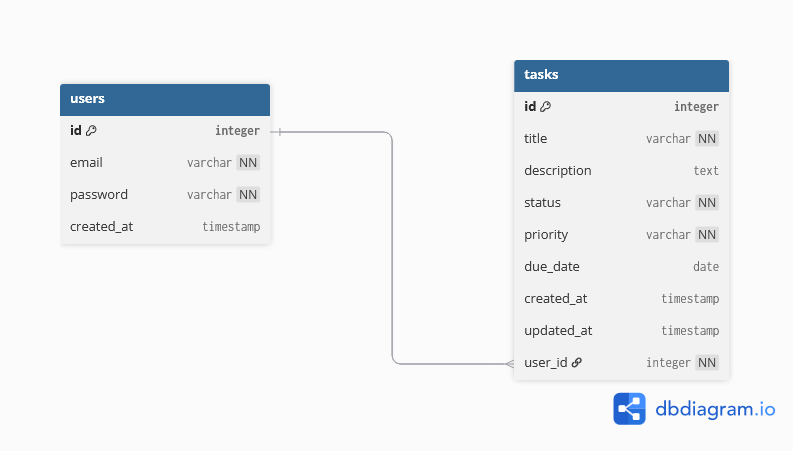

# Database Design

## Entity Relationship Diagram

## Models

### User
Managed by Django's built-in auth system.

### Task

| Field | Type | Description |
|---|---|---|
| id | Integer | Primary key, auto-generated |
| title | CharField | Task title, required |
| description | TextField | Optional description |
| status | CharField | pending / in_progress / completed |
| priority | CharField | low / medium / high |
| due_date | DateField | Optional due date |
| created_at | DateTimeField | Auto-generated |
| updated_at | DateTimeField | Auto-generated |
| user | ForeignKey | Owner of the task |